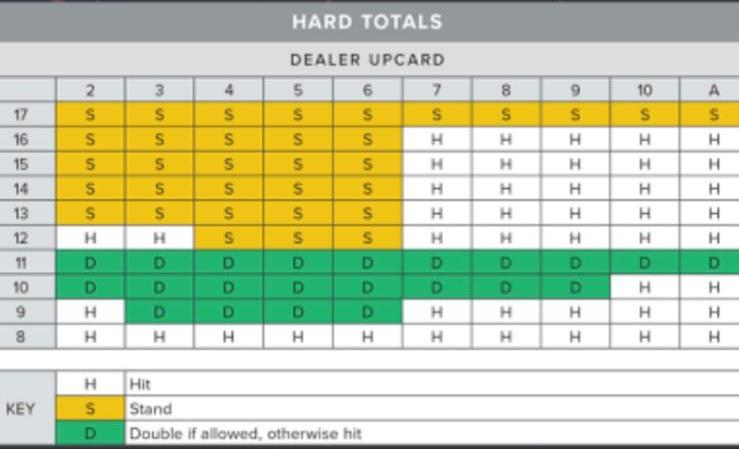

# AI Agent For Game BlackJack
This repository's goal is to train a blackjack agent. 

This rrepository is currentlly under progress. You can follow the status by checking the project board [here](https://github.com/hakanonal/blackjack/projects/1).

As a habbit I also keep a journal for myself. I keep it as jupyter notebook [here](experiment.ipynb).

This idea has been started with a conversation that I have made with my nephew. He asked me if we could build an AI agent that plays the best moves for blackjack. After some arguing on the topic, we have agreed that it would be overkill to train a deep net. Hence there were already best posible moves avaible. However this table only keeps the best action to play in a total matrix of player and dealer. So we have agreed to at least to construct a q-value table via reinforcement learning. We are expecting to construct a q-value table that will consists of the best move to to make (Hit,Double,Stand) in percentages. Our intension is to keep it simple so we will not implement the full rrules of the game. We will consider Ace as 1 not 11. I've learned that this is called hard totals. The avaible best moves are as follows:

So our plan is to put the percentages of each action for each state. (Q-Values). If you have more to do please do not hesitate to chip-in.

If you have any contrubutions please do not hesitade to open a [new issue](https://github.com/hakanonal/blackjack/issues/new).
